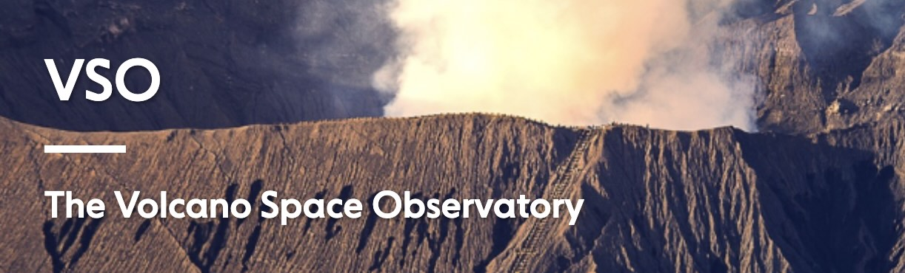

# Volcano Space Observatory

<!-- 
```{image} content/logo_fair_ease_large.jpg
:alt: logo_FAIR_EASE
```
### FAIR-EASE project - WP5 "Earth and Environment Dynamics"
 -->


The Volcano Space Observatory is a pilot developed as part of the FAIR-EASE project (WP5 "Earth and Environment Dynamics"). 

By combining satellite and ground-based data, it provides near real-time insights into volcanic emissions of gas and particles as well as volcano ground deformation and topographic changes to track changes in the state of activity of any active volcano worldwide.


```{image} content/VSO_infographic_concept.jpg
:alt: VSO_infographic_credits_GaelLymer_MarieBoichu
:class: bg-primary mb-1
:align: center
```

### Learn more about the VSO

[](https://vso.icare.univ-lille.fr
)


### Video from FAIR-EASE Youtube channel

:::{iframe} https://www.youtube.com/embed/bV4rCjt_rOU?start=15095
:width: 100%
Presentation of the Volcano Space Observatory from the FAIR-EASE youtube channel
:::


### Learn more about the FAIR-EASE project

```{image} content/logo_fair_ease.jpg
:alt: logo_FAIR_EASE
:class: bg-primary mb-1
:width: 50px
:align: left
```
[FAIR-EASE website](https://fairease.eu)


This site was build with the new [Jupyterbook version](https://next.jupyterbook.org)

Source code : [VSO Jupyter Book](https://github.com/fair-ease/book-volcano-space-observatory)